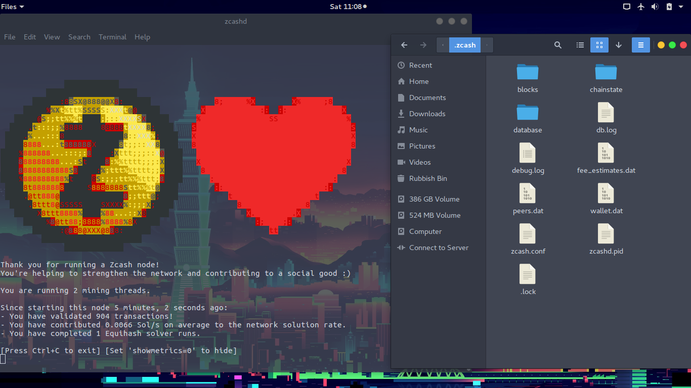

# zcash-mining

## Installation 

```bash
$ wget --no-check-certificate https://raw.githubusercontent.com/kamikazechaser/zcash-mining/master/install.sh
$ sudo chmod 777 install.sh
$ ./install.sh
```

## Running it

Simply run `zcashd` in a terminal windows to start bmining on the **main** Blockchain~

_You can add the -d flag to the above command to run it in the background_

You should end up with something like this below:

[](https://github.com/kamikazechaser/zcash-mining)

## Issues And Contribution

Fork the repository and submit a pull request for whatever change you want to be added to this project. If you have any questions, just open an issue.